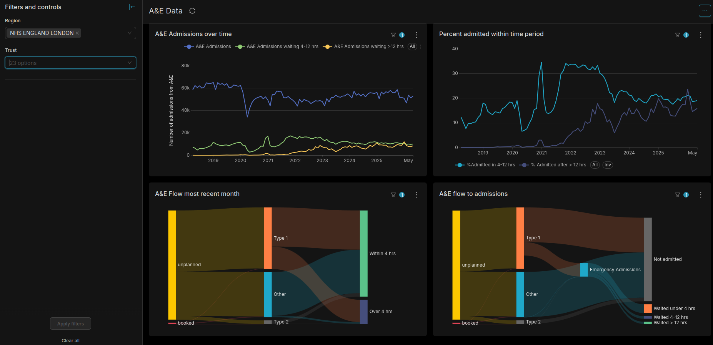
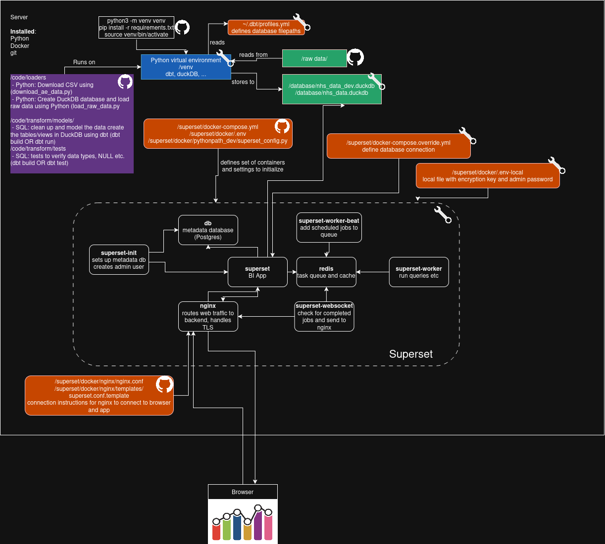

# Open Source Data Warehouse

While I worked at Epic, I created a dashboard (along with colleagues) to show published NHS data across trusts using Epic's tools (SSIS/SQL for getting data into Caboodle (Epic's data warehouse), Caboodle tools for creating the data models, SlicerDicer and Radar for visualisation). Here, I've recreated a proof of concept using open source tools. I've used Python with [DuckDB](https://duckdb.org/) as the database, [dbt](https://www.getdbt.com/) to move and model the data, and [Apache Superset](https://superset.apache.org/) as the visualisation tool. My intent is to add multiple datasets but I've started with the A&E data from [here](https://www.england.nhs.uk/statistics/statistical-work-areas/ae-waiting-times-and-activity/).

I did this in Visual Studio Code with Claude Code and Github Copilot.



## Stack
- **DuckDB** — analytical query engine
- **dbt** — data transformation
- **Apache Superset** — visualisation and dashboards
- **Apache Airflow** — orchestration (Not added yet)
- **MinIO** — object storage (Not added yet)
- **Apache Iceberg** — table format (Not added yet)

## Prerequisites
- Python 3.12+
- Git
- Docker

## Data Sources
 - NHS A&E data: https://www.england.nhs.uk/statistics/statistical-work-areas/ae-waiting-times-and-activity/
  - Column definitions: https://www.england.nhs.uk/statistics/wp-content/uploads/sites/2/2025/11/AE-Attendances-Emergency-Definitions-v5.0-final-August-2020.pdf


## Project Structure

NHS data is published online in CSV files. 

The steps are:
1. Find and download the files within a date range
2. Load the data into a DuckDB database
3. Clean up the data and do some tests (change datatypes, rename columns, check for nulls, etc)
4. Create datamarts
5. Spin up Superset services within docker containers to serve the Superset UI to a URL
6. Use Superset UI to connect to database and use datamarts to create graphs/dashboard

Steps 1-4 are handled by https://github.com/adrianna-teriakidis/DuckDB-data-warehouse.git; steps 5-6 need https://github.com/adrianna-teriakidis/superset.git

## Pre-work

Clone the database repository
```bash
   git clone https://github.com/adrianna-teriakidis/DuckDB-data-warehouse.git
   cd DuckDB-data-warehouse
```

Create and activate virtual environment
```bash
   python3 -m venv venv #create, run once
   source venv/bin/activate #activate, run each time you start up working on this
```

Install dependencies
```bash
   pip install -r requirements.txt #within virtual env
```
## Setup

### 1. Find and download the files within date range
/code/loaders/download_ae_data.py
This step is webscraping with Python

Commands (within virtual environment)
```bash
cd "code/loaders"
python download_ae_data.py                    # latest fiscal year only
python download_ae_data.py --from-year 2023 --to-year 2024
python download_ae_data.py --all               # everything back to 2018
```

- Constructs the year-specific URLs, reads the webpages and finds the CSV files
- Checks the found CSVs against what is currently in the folder and discards ones that already exist
- Downloads new files and checks if any months in the date range are missing or if there are any duplicates
- Can take 4 inputs:
	- --from-year
	- --to-year
	- --all
	- --domain (folder to save files in, default: ae_data)

### 2. Load the data into a DuckDB database
/code/loaders/load_raw_data.py
This uses Python to interact with DuckDB

Commands (within virtual environment)
```bash
python load_raw_data.py ae_data --target dev   # or --target prod
```
-  Find the path to "PROJECT_ROOT/raw data/" folder in the project tree
- Connect to existing or Create a new DuckDB database
- For the subfolder that matches "domain", add all files to a table with the name of the "domain". (so in this instance you call it with ae_data, it reads all the CSVs in raw "data/ae_data/" and loads them to a table called ae_data)
	- the column name in the file becomes the column name in the table

### 3. Clean up the data and do some tests
/code/transform/models/staging/stg_ae_data.sql
/code/transform/models/staging/_models.yml
/code/transform/tests/assert_stg_ae_data_no_duplicate_period_org.sql
This uses SQL to build the dbt functions

#### Manual step
create ~/.dbt/profiles.yml to define database targets for dev/prod. My file looks like this
```bash
transform:
  outputs:
    dev:
      type: duckdb
      path: /home/xxx/yyy/zzz/[project root]/database/nhs_data_dev.duckdb
      threads: 1

    prod:
      type: duckdb
      path: /home/xxx/yyy/zzz/[project root]/database/nhs_data.duckdb
      threads: 4

  target: dev
```
Commands (within virtual environment)
```bash
cd "code/transform"
dbt run --select staging #--target prod to run in prod instead of dev
dbt test --select staging
```

- Cleans up the column names
- Coalesces the columns where the name has changed over time but represent the same data
- Adds a real DATE column
- Removes TOTAL rows
- Adds a flag for whether a certain org ever has reported data (some orgs in the dataset have only reported zeros)
- Checks that every row has an org_code and a date, and that the combination of org_code and date is unique, as this is the designated primary key

### 4. Create datamarts
/code/transform/models/marts/
This uses SQL to build dbt datamarts. There is one .sql script per datamart.

Commands (within virtual environment)
```bash
dbt run --select marts
```
Can also combine steps 3&4 with 
```bash
dbt build --select staging marts
```
marts/
- dim_org.sql
- fact_ae_admissions.sql
- fact_ae_attendances.sql
## End of DuckDB-data-warehouse repo. 
You can now load additional months of data (if they exist), and query the data/datamarts that are there.

## Superset fork

Clone the superset repository
```bash
   git clone https://github.com/adrianna-teriakidis/superset.git
   cd superset
```
Create superset/docker-compose.override.yml to tell superset how to access your database. I have some extra stuff in there for my VPS.
```bash
services:
  superset:
    volumes:
      - "../[project root]/database:/app/nhs_data:ro"
```
Copy superset/docker/.env-local.example to .env-local and you can use it to add your own admin password and secret key. If you do nothing you can use the defaults.

### 5. Spin up Superset services within docker containers to serve the Superset UI to a URL

Commands for development:
```bash
docker compose up -d
```

Commands for prd use:
```bash
docker compose -f docker-compose-non-dev.yml -f docker-compose.override.yml up -d
```

### 6. Use Superset UI to connect to database and use datamarts to create graphs/dashboard

My example dashboard is exported and saved in /dashboards/ae_dashboard/ (in the DuckDB-data-warehouse repo) which can be imported to Superset using the UI.

Here's a diagram of how the pieces fit together that I made for myself.
